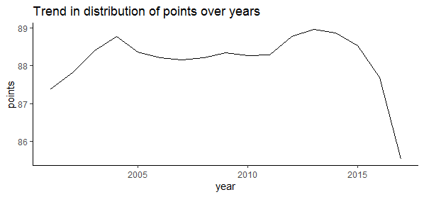
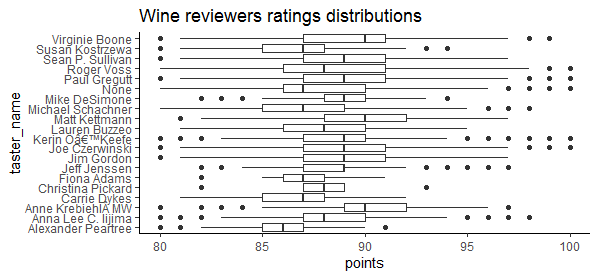
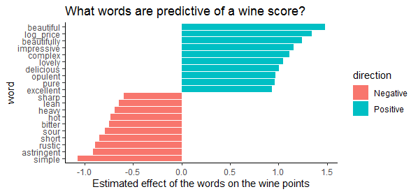
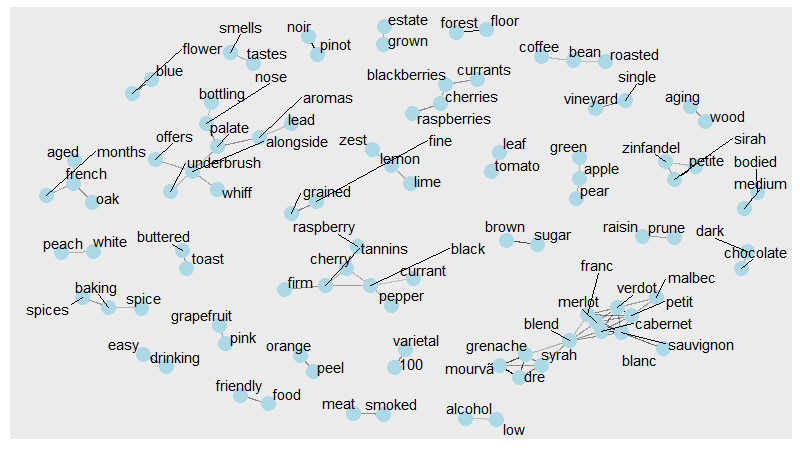
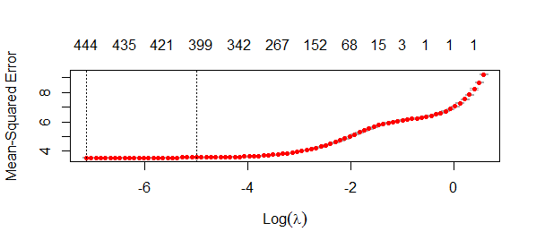
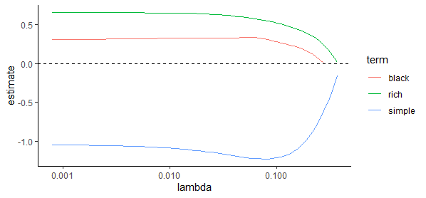
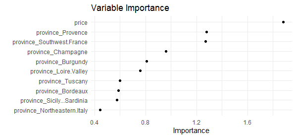

# Wine-Rating-Prediction

## Project Overview

The dataset contains information about various variety of wine like country, region and province the wine was manufactured, price of the wine. It also contains tasters' reviews on the wine.

The goal is to predict the points given to the wine by the different tasters.

## EDA

Here are some of the highlights of the visualizations I did.

I also performed text mining to see the effects of the words used by the tasters on the points of the wine.

Here are some of the visualizations.

## Model Building

I performed text mining using the tidytext package and did a lasso regression on the words to see their effects on the ratings.

I also did a lasso regression on the rest of the dataset and build a model to predict the ratings of the wine.

There wasn't enough predictor variables but i built a decent model with the following outcomes.

-Mean Absolute Error (MAE): 1.77

-Root Mean Squared Error(RMSE): 2.24

-R-squared(rsq): 0.421

